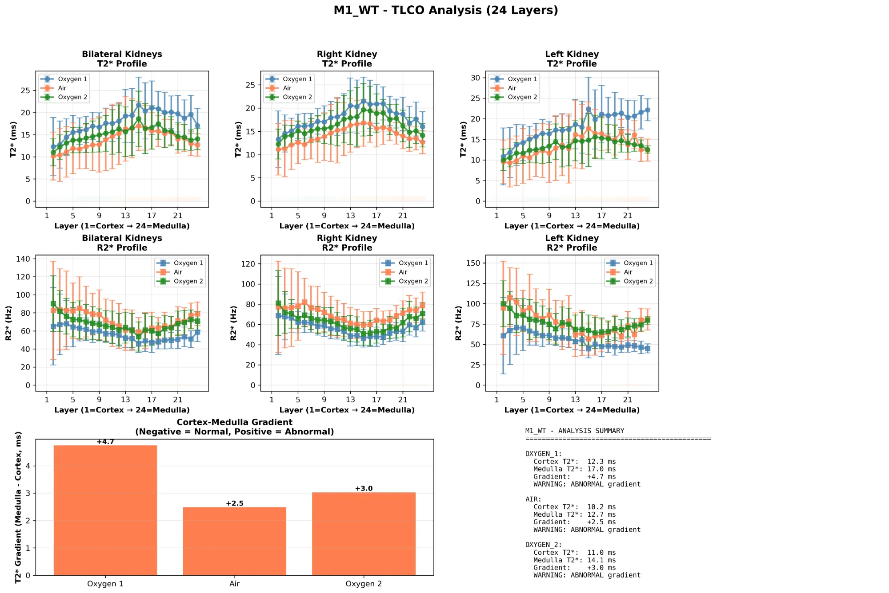
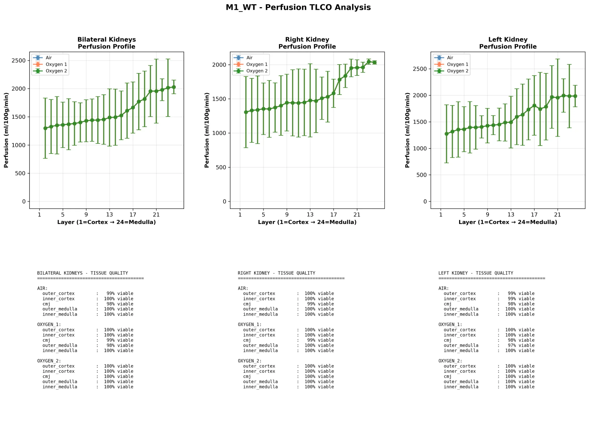
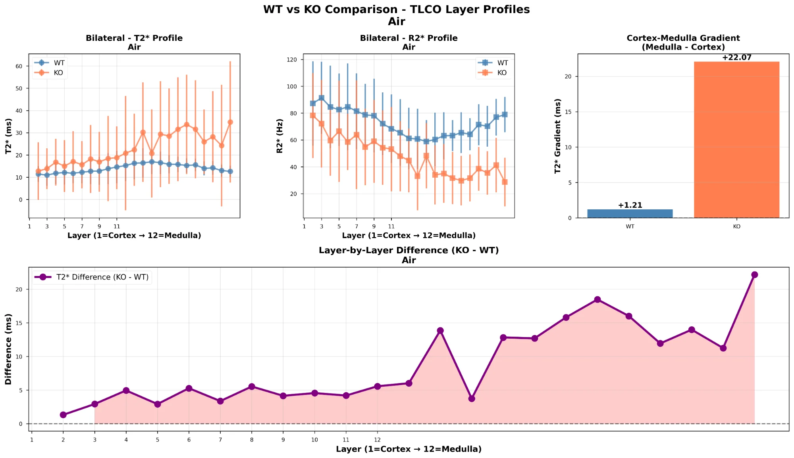

# BoldPy v2.2.1

**Tissue-Agnostic BOLD MRI Analysis Framework with Multi-Layer Concentric Object (MLCO) Analysis**

[](https://www.python.org/downloads/)
[](LICENSE)

---

## Features

- **Multi-Layer Concentric Object (MLCO) Analysis** - Layer-by-layer quantification from surface to center
- **Bilateral Organ Support** - Analyze both organs simultaneously with automatic splitting
- **Intelligent T2* Detection** - Tiered frame identification (metadata → heuristic → manual)
- **T2*/R2* Quantification** - Custom fitting or Bruker extraction
- **Perfusion Integration** - Three-modality analysis (T2*, R2*, perfusion) with automatic upsampling
- **Continuous Whole-Kidney Visualization** - Complete organ profiles (cortex → medulla → papilla)
- **Tissue Quality Assessment** - Per-pixel viability classification with configurable thresholds
- **Oxygen Responsiveness** - ΔT2* calculations for functional assessment
- **Group Comparisons** - Statistical analysis with comprehensive visualizations
- **Robust Data Handling** - Automatic handling of missing layers and incomplete data
- **Comprehensive Visualization** - 18 plotting functions for all analysis types

---

## What's New in v2.2.1

### 🎯 **Tiered T2* Frame Detection**
Intelligent three-tier approach for robust T2* frame identification:
1. **Metadata parsing** - Reads Bruker `VisuCoreFrameType` labels
2. **Enhanced scoring** - Multi-factor heuristic (100-point system)
3. **Manual override** - New `--t2-frame N` option

```bash
# Automatic detection (metadata → heuristic)
python prepare_data.py --input scan.PvDatasets --output-dir prepared/

# Manual override
python prepare_data.py --input scan.PvDatasets --output-dir prepared/ --t2-frame 3
```

### 📊 **Continuous Whole-Kidney Plotting**
New visualization showing entire kidney as one continuous profile:
- Cortex → Medulla → Papilla sequential visualization
- T2*, R2*, and Perfusion in integrated panels
- Configurable tissue viability thresholds
- Group comparison overlays

### 🔧 **Enhanced Robustness**
- **Missing layers:** Automatically fills gaps with NaN (no crashes!)
- **Layer numbering:** Infers from position when field missing
- **Integer axes:** Clean whole-number layer labels

### 🎨 **Perfusion Integration**
Complete perfusion support in all Phase 2 plots with automatic upsampling (80×80 → 200×200)

See [CHANGELOG.md](CHANGELOG.md) for complete details.

---

## System Requirements

- Python 3.8 or higher
- NumPy, SciPy, Matplotlib
- For Bruker data: zipfile support (standard library)
- Optional: mkdocs for documentation

---

## Example Output

### Layer Profiles


### Perfusion Integration


### Group Comparison


*(Example images - see uploads folder for actual outputs)*

---

## Citation

If you use BoldPy in your research, please cite:

```bibtex
@software{boldpy2026,
  title = {BoldPy: Tissue-Agnostic BOLD MRI Analysis Framework},
  author = {Your Name},
  year = {2026},
  version = {2.2.0},
  url = {https://github.com/yourusername/boldpy}
}
```

---

## License

This project is licensed under the MIT License - see the [LICENSE](LICENSE) file for details.

---

## Contributing

Contributions are welcome! Please feel free to submit a Pull Request.

---

## Support

- **Documentation:** [docs/](docs/)
- **Issues:** [GitHub Issues](https://github.com/yourusername/boldpy/issues)
- **Changelog:** [CHANGELOG.md](CHANGELOG.md)

---

## Acknowledgments

- Bruker BioSpin for PvDatasets format documentation
- Scientific community for BOLD MRI methodology
- Open-source Python ecosystem

---

**BoldPy v2.1.1** - January 2026
